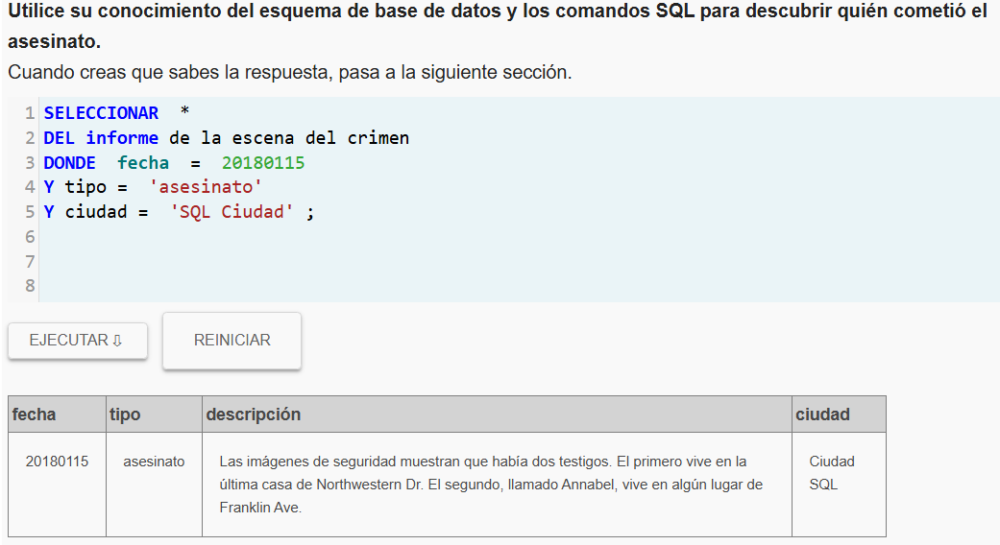
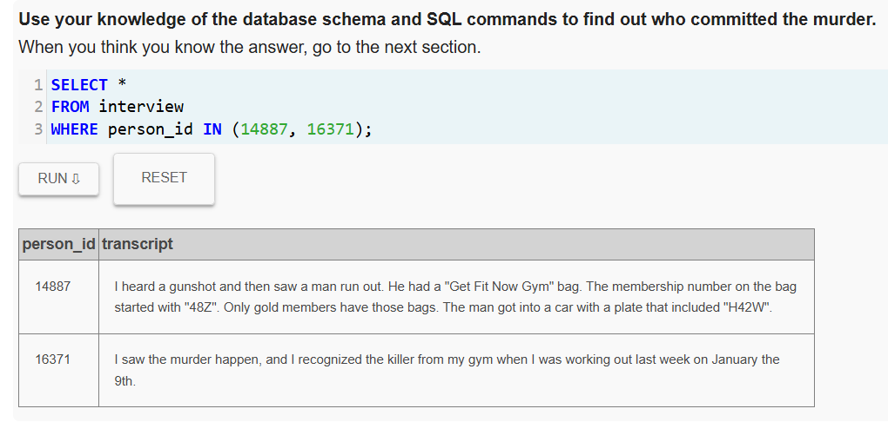
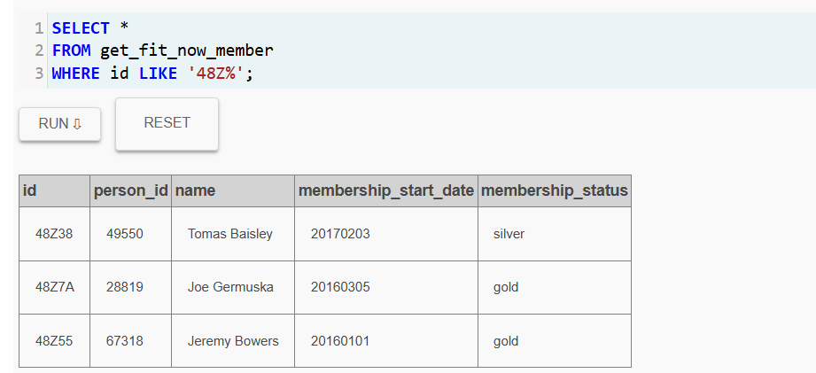
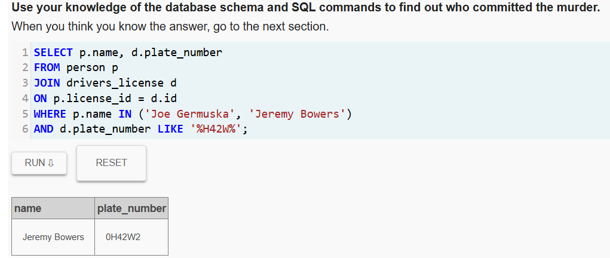
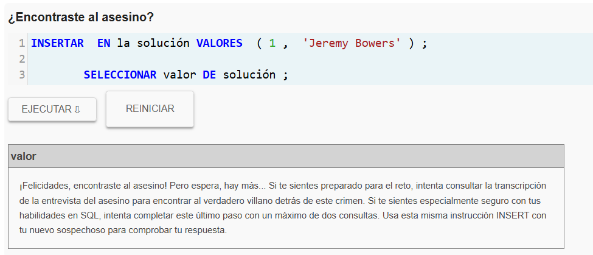
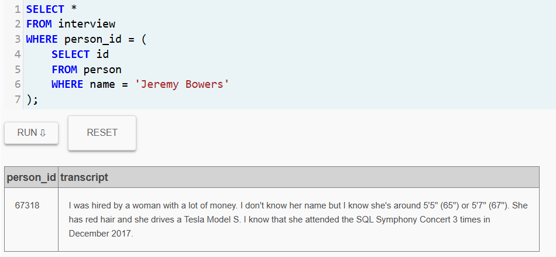
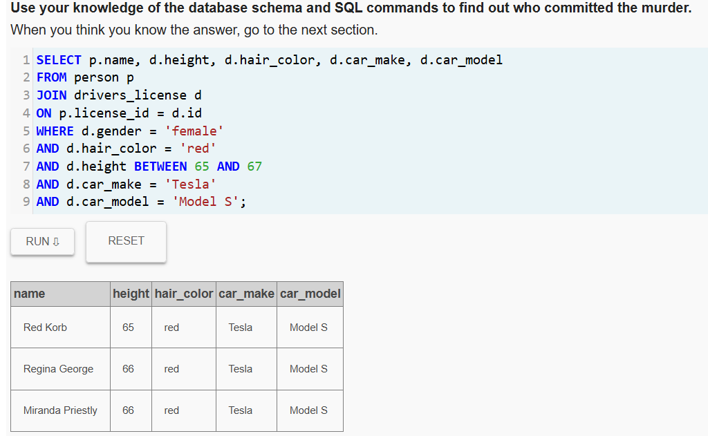
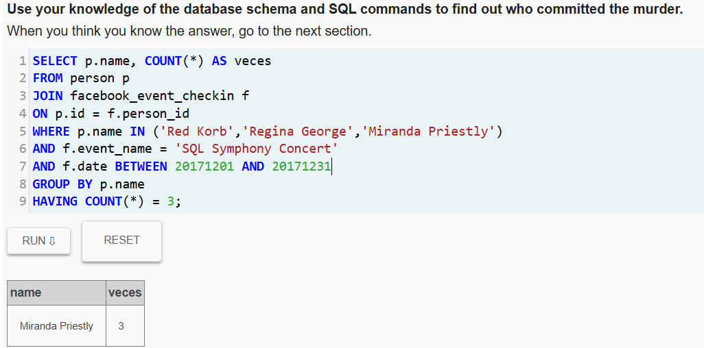
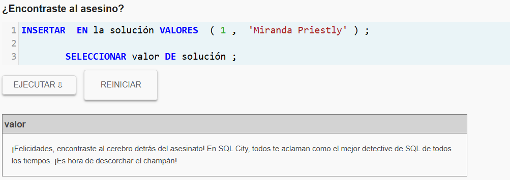

# lab2-sql-murder-juanjosegomezcastano

# 🕵️‍♂️ SQL Murder Mystery – Informe de Investigación

**Actividad:** Laboratorio SQL Murder Mystery

**Estudiante:** Juan José Gómez Castaño

## 📑 Tabla de Contenido

- [Resumen del Caso](#-resumen-del-caso)
- [Bitácora de Investigación](#-bitácora-de-investigación)
  - [1️⃣ Identificación del crimen](#1️⃣-identificación-del-crimen)
  - [2️⃣ Identificación de los testigos](#2️⃣-identificación-de-los-testigos)
  - [3️⃣ Entrevistas de los testigos](#3️⃣-entrevistas-de-los-testigos)
  - [4️⃣ Búsqueda de sospechosos del gimnasio](#4️⃣-búsqueda-de-sospechosos-del-gimnasio)
  - [5️⃣ Identificación del vehículo](#5️⃣-identificación-del-vehículo)
  - [6️⃣ Entrevista del asesino](#6️⃣-entrevista-del-asesino)
  - [7️⃣ Identificación de la autora intelectual](#7️⃣-identificación-de-la-autora-intelectual)
  - [8️⃣ Confirmación final](#8️⃣-confirmación-final)
- [Conclusión de la Investigación](#️-conclusión-de-la-investigación)
- [Confirmación del caso](#-confirmación-del-caso)

---

# 📌 Resumen del Caso

El 15 de enero de 2018 ocurrió un asesinato en **SQL City**. A partir del reporte de la escena del crimen y las declaraciones de los testigos, se inició una investigación utilizando consultas SQL para analizar diferentes tablas de la base de datos.

Durante el proceso se logró identificar al **asesino directo Jeremy Bowers**, quien posteriormente confesó haber sido contratado por una mujer con ciertas características específicas. Tras analizar los registros de licencias de conducir y asistencia a eventos, se determinó que la autora intelectual del crimen es **Miranda Priestly**.

---

# 🔎 Bitácora de Investigación

## 1️⃣ Identificación del crimen

Primero se revisaron los reportes de crímenes registrados para encontrar el asesinato ocurrido el **15 de enero de 2018 en SQL City**.

```sql
SELECT *
FROM crime_scene_report
WHERE date = 20180115
AND type = 'murder'
AND city = 'SQL City';
```

Esta consulta permitió obtener la descripción del crimen, donde se menciona que **dos testigos presenciaron el hecho**.



---

## 2️⃣ Identificación de los testigos

El reporte indicaba lo siguiente:

* El primer testigo vive en **la última casa de Northwestern Dr**
* El segundo testigo se llama **Annabel** y vive en **Franklin Ave**

### Primer testigo

```sql
SELECT *
FROM person
WHERE address_street_name = 'Northwestern Dr'
ORDER BY address_number DESC
LIMIT 1;
```

Resultado: **Morty Schapiro**

### Segundo testigo

```sql
SELECT *
FROM person
WHERE name LIKE 'Annabel%'
AND address_street_name = 'Franklin Ave';
```


---

## 3️⃣ Entrevistas de los testigos

Una vez identificados los testigos, se revisaron sus declaraciones utilizando sus identificadores.

```sql
SELECT *
FROM interview
WHERE person_id IN (14887, 16371);
```

Las entrevistas revelaron información importante:

* El asesino tenía una **bolsa del gimnasio Get Fit Now Gym**
* La membresía comenzaba con **48Z**
* Solo los **miembros Gold** poseen esa bolsa
* El asesino escapó en un automóvil cuya matrícula contenía **H42W**




---

## 4️⃣ Búsqueda de sospechosos del gimnasio

Con la pista de la membresía, se buscaron miembros del gimnasio cuyo ID comenzara con **48Z**.

```sql
SELECT *
FROM get_fit_now_member
WHERE id LIKE '48Z%';
```

Esto permitió identificar dos sospechosos:

* Joe Germuska
* Jeremy Bowers



---

## 5️⃣ Identificación del vehículo

Posteriormente se investigó cuál de los sospechosos poseía un automóvil con matrícula que contuviera **H42W**.

```sql
SELECT p.name, d.plate_number
FROM person p
JOIN drivers_license d
ON p.license_id = d.id
WHERE p.name IN ('Joe Germuska', 'Jeremy Bowers')
AND d.plate_number LIKE '%H42W%';
```

El resultado mostró que **Jeremy Bowers** posee un vehículo con la matrícula **0H42W2**.



Esto confirma que **Jeremy Bowers es el asesino directo**.



---

## 6️⃣ Entrevista del asesino

Luego se revisó la entrevista de Jeremy Bowers para obtener más información sobre el caso.

```sql
SELECT *
FROM interview
WHERE person_id = (
    SELECT id
    FROM person
    WHERE name = 'Jeremy Bowers'
);
```

En su declaración confesó haber sido contratado por una mujer con las siguientes características:

* Mujer
* Altura entre **65 y 67 pulgadas**
* **Cabello rojo**
* Conduce un **Tesla Model S**
* Asistió **3 veces al SQL Symphony Concert en diciembre de 2017**



---

## 7️⃣ Identificación de la autora intelectual

Se buscaron personas que coincidieran con las características mencionadas por el asesino.

```sql
SELECT p.name, d.height, d.hair_color, d.car_make, d.car_model
FROM person p
JOIN drivers_license d
ON p.license_id = d.id
WHERE d.gender = 'female'
AND d.hair_color = 'red'
AND d.height BETWEEN 65 AND 67
AND d.car_make = 'Tesla'
AND d.car_model = 'Model S';
```

Se encontraron tres posibles sospechosas:

* Red Korb
* Regina George
* Miranda Priestly



---

## 8️⃣ Confirmación final

Para identificar cuál de ellas asistió **3 veces al concierto en diciembre de 2017**, se realizó la siguiente consulta:

```sql
SELECT p.name, COUNT(*) AS veces
FROM person p
JOIN facebook_event_checkin f
ON p.id = f.person_id
WHERE p.name IN ('Red Korb','Regina George','Miranda Priestly')
AND f.event_name = 'SQL Symphony Concert'
AND f.date BETWEEN 20171201 AND 20171231
GROUP BY p.name
HAVING COUNT(*) = 3;
```

El resultado identificó a **Miranda Priestly** como la única persona que cumple todas las condiciones.



---

# ⚖️ Conclusión de la Investigación

A través del análisis de las diferentes tablas de la base de datos se logró reconstruir completamente el caso:

* Se identificó al **asesino directo Jeremy Bowers** mediante la pista de la membresía del gimnasio y la matrícula del vehículo.
* En su entrevista confesó haber sido contratado.
* Cruzando información de **licencias de conducir** y **registros de eventos**, se determinó que la persona que coincide con todas las características es **Miranda Priestly**.

Por lo tanto, existen **pruebas suficientes para acusar a Miranda Priestly como autora intelectual del asesinato**.

---

# ✅ Confirmación del caso





---
